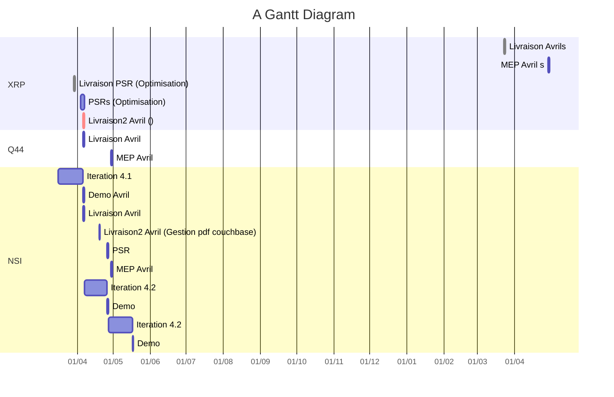

# Planning des livraisons

```mermaid
gantt
    title A Gantt Diagram
    dateFormat  DD/MM/YYYY
    axisFormat  %d/%m
    
    section XRP
    Livraison Avrils    : done, 23/03/2022, 1d
    MEP Avril s          : 29/04/2022, 1d
    Livraison PSR (Optimisation)    : done, 29/03/2021, 1d
    PSRs (Optimisation)              : 04/04/2021, 3d
    %% release/s :
    Livraison2 Avril ()    : crit, 06/04/2021, 1d
    
    section Q44
    Livraison Avril         : 06/04/2021, 1d
    MEP Avril               : 29/04/2021, 1d
    
    section NSI
    Iteration 4.1           : 16/03/2021, 06/04/2021
    Demo Avril              : 06/04/2021, 1d
    Livraison Avril         : 06/04/2021, 1d
    Livraison2 Avril (Gestion pdf couchbase)        : 19/04/2021, 1d
    PSR                     : 26/04/2021, 1d
    MEP Avril               : 29/04/2021, 1d
    Iteration 4.2           : 07/04/2021, 26/04/2021
    Demo                    : 26/04/2021, 1d
    Iteration 4.2           : 27/04/2021, 17/05/2021
    Demo                    : 17/05/2021, 1d

```
